# Reservation Table and Collisions

## A Reservation Table

The rows represent the functional units, while each column represents an instruction cycle.

If in an instruction cycle j, functional unit i was being used (i.e. active), the location (i, j) in the reservation table is marked as active.

If move than one functional unit is busy during the same instruction cycle, all rows that correspond to active units during that instruction cycle are marked.

Example:

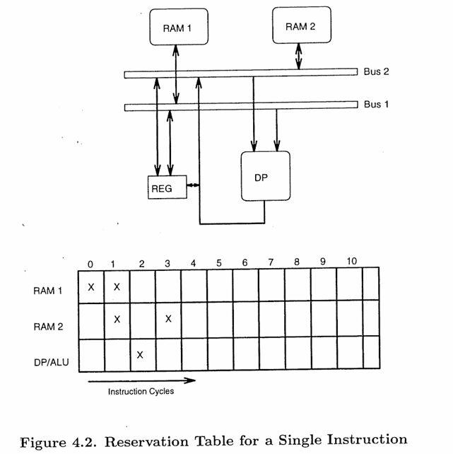

- In the instruction cycle 0, the instruction is *fetched* and *decoded* from RAM1.

- Then during instruction cycle 1, two operands are fetched in parallel from RAM1 and RAM2. 

- The ALU/DP operates on the two operands during the next instruction cycle (2).

- The result is then stored in RAM2.

- RAM2 is *busy* during instruction cycles 1 and 3. The DP is *busy* only during instruction cycle 2.

- **Assign a varibale r(i), for i = 1, 2, 3, ... that lists the instruction cycles when the corresponding functional unit is busy in increasing order**

- For RAM1, r(1) = 0 and r(2) = 1 while for DP/LPU, r(1) = 2

## Collision

A collision represents the fact that two different operations try to use a functional unit during the *same* cycle.

Example:

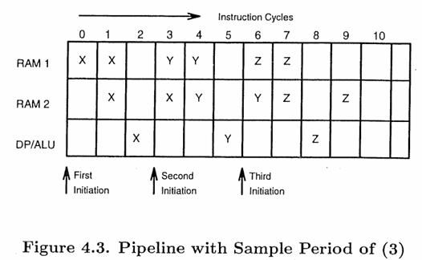

- the second instruction (described in X), was initiated in the instruction cycle 1, it would have **collided** with the RAM1 access of the preceding instruction.

- Similar problem arise, if the second instruction Y was initiated in the instruction cycle 2.

## Sample Period (SP)

**The earlist possible initiation of the succeeding instruction without collision** is defined as the sample period, L.

The sample period in this example is (3)

## Average Sample Period(ASP)

Example:

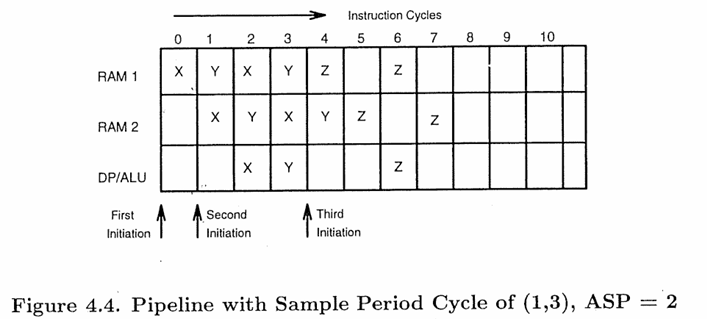

**Sample period cycle**: the sample periods alternate between 1 and 3

**Average sample period** for this example is $(1 + 3) = 2$ and the period $p$ is $(1 + 3) = 4$

**Initiation rate** of instructions per instruction cycle: the inverse of the average sample period.
    
- In this example, the inititation rate is $1 / 2 = 0.5$ instruction per instruction cycle

## Minimum average sample period(MASP)

The **MASP** that can be achieved determines the efficiency of the realization of piepline.

Need to determine:

- if **a lower bound** on the MASP can be derived from the reservation table.

- if the reservation table can be modified (while **maintaining precedence relationships**) to achieve this MASP

## Initial Collision Vector

The initial collision vector is a control word that determines when a second instruction can be initiated given that the same instruction was initiated at the instruction cycle 0.

For example, the collision vector for the reservation table Figure 4.2 is (1110), where a 1 indicates that the succeeding instruction cannot be initiated during the the corresponding instruction cycle.

The earlist possible initiation is during instruction cycle 3 with a sample period of (3).

A **Greedy** strategy is one where the second (and successive) instruction(s) is(are) issued at the first availble oppotunity.

- This may not always be optimal.

- For instance, a cycle of (1, 5) is not as efficient as (2, 2). The latter strategy has an ASP of 2, while the former (greedy) startegy has an ASP of 3.

## Theorems

### Theorem 1. 

*Given a reservation table for an instruction, the lower bound on the average sample period is equal to the maximum number of cycles marked busy in any row in the table. The lower bound is called the MASP*

(lower bound of MASP)

### Theorem 2. 

*The sample period of any greedy cycle for a reservation table is bounded from above by the number of 1's in the initial collision vector* 

(upper bound of greedy cycle)

### Theorem 3. 

*If the maximum number of busy instruction cycles in any row of the reservation table equals the number of 1's in the initial collision vector, then all greedy cycles are optimal. In addition, even if the bounds are not equal, and a greedy cycle has a sample period equal to the lower bound, it is optimal* 

(once equal, all optimal)

### Theorem 4. 

*The reservation table can be modified by the insertion of delays to accept any sample period cycle consistent with the lower bound on the sample period, specified by Theorem 1* 

(Insert delay to achieve optimal cases)

## Construction of Optimal Pipelines

Let's call the theorem 1's lower bound as bound $M$. (It may not be achieved, the achieved one is called minimum average sample period (MASP))

Construct **a sample period cycles**, $(c_1, c_2, ..., c_i)$, with an average sample period equal to $M$

Let **the** $\underline{\text{ period }} p$ **of this sample cycle be** $p = \sum c_i $

Given the numbers $c_i$, a set of numbers, $\mathcal{G}$, is generated that is obtained from $c_i$'s by summing them alone, two at a time, three a time, and so on *(mod p)*

- E.g. if an initial cycle is (2, 3, 7) and $p = \sum c_i = 12$, then the generated set, $\mathcal{G}$, consists of numbers [0, 2, 3, 5, 7, 9, 10]. (5 = 2 + 3, 9 = 2 + 7, 10 = 3 + 7)

$\underline{\text{Source set }} S$ is constructed by removing all numbers from 1 to $p - 1$ that are in $\mathcal{G}$.

- E.g. $S$ is [1, 4, 6, 8, 11]

$\underline{\text{Design set }} D$ are **those subsets of S and elements are *compatible* with each other**

, where $\underline{\text{compatibility}}$ means **any differences of any two elements in a design set belongs to that design set $D$ as well**.

- E.g. consider a reservation table with $M$ = 2. Sample period of 2 or (1, 3) are both consistent with the value of $M$

- For the cycle (1, 3), $p = 4$, the source set $S$ is [0, 2], and the design set $D$ is [0, 2]. 

- For the cyle of (2), $p = 2$, the source set $S$ is [0, 1], and the design set $D$ is also [0, 1].

- For the sample cycle of (1, 5), $p = 6$, the source set $S$ is [0, 2, 3, 4], and the deisgn sets $D$ can be [0, 2], [0, 3], [0, 4], [0, 2, 4], and [2, 4]

    - [2, 3] and [3, 4] are not compatible, because $|2 - 3| = 1 ∉ [2, 3]$ and $|3 - 4| = 1 ∉ [3, 4]$ 

## Design of a Modified Reservation Table

Given a reservation table, construct the set $R$ of $r(i)$'s for each row. 

Let us assume that a compatible design set $D$ has elements $d(i)$. 

- **Compare $r(1)$ and $d(1)$ for a row of the given reservable table.**

    - **If $r(1)$ is less than $d(1)$, the insert $d(1)$ - $r(1)$ delays in *front* of the first busy instruction cycle of the row. All other busy instruction cycles in the same row of the reservation table are also moved to the right by the same amount**

    - **If $r(1)$ is larger than (or equal to) $d(1)$, then the integer $(r(1) - d(1))$ mod $p$ is added to each element of the compatible design set $D$.**

- **The rest of the busy instuction cycles are processed as follows:**

    - **Proceeding from left to right, if $r(i)$ is less than (or equal to) $d(i)$, the $i$ th busy instruction cycle is delayed by $d(i) - r(i)$ cycles, and all other busy instruction cycles move to the right by the same amount.**

    - **If $r(i)$ is larger than $d(i)$, then sufficient multiples of $p$ are added to $d(i)$ such that this $d(i)$ is greater than (or equal to) $r(i)$. Then the busy instruction cycle $i$ is delayed by $r(i) - d(i)$, and all other cycles are shifted right by the same amount.**

## Example 1:

Consider the reservation table in Figure 4.2. $M$ = 2, and a sample period cycle is (2), (through this may not be possible, just try, achieve the MASP). 

- $r(1)$ and $r(2)$ for row 1 (corresponding to RAM1) are 0 and 1 respectively. Comparing with a design set [0, 1], this row does not need any modifification, as both sets are matched.

- Simiarly, $r(1)$ and $r(2)$ for row 2 (corresponding to RAM2) are 1 and 3 respectively. Comparing with the design set, [0, 1], we see that r(1) is greater than d(1). The integer $(1 - 0) \text{ mod } p$ is addede to each element in the design set $D$ to obtain a new design set, [1, 2]

    - Proceeding from left to right, we observe that $r(2) = 3$ is greater than the modified $d(2) = 2$. As a consequence, $p = 2$ is added to $d(2)$ in the integer 4.

    - The second busy instruction cycle is then delayed by (4 - 3) or 1. 
    
    - So, the result of the ALU/DP operation is stored in RAM2 during instruction cycle 4 instead of instruction cycle 3 as in the original reservation table.

- The third row of the reservation table consists of only *one* busy instruction cycle, and it is not affected by the procedure, since $r(1)$ is greater than $d(1)$ in the compatible set.

The final rescheduling pipline will have **a sample period of 2, which is equal to the MASP**.

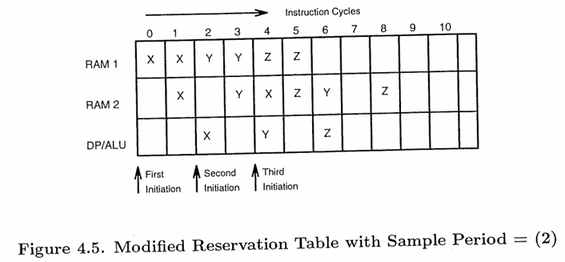

# Fast Adders

High Speed Adders

- **Ripple-Carry Adders** (operate *two words* at a time)

    - **Carry-Bypass Adder**

    - **Carry-Select Adder**

- **Carry-Lookahead Adders** (operate *two words* at a time)

- **Carry-Save Adders** (operate on *three or more words*, very useful in the design of *fast multipliers*)

## Ripple-Carry Adders

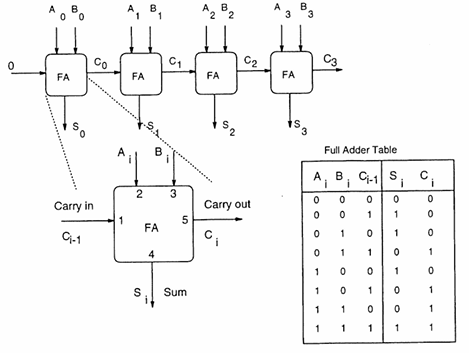

The carry ripples through each *full adder* (FA) until the sum is calculated. The time required for the addition of two $N$ bit numbers, $t_{add}$:

$$t_{add} = (N  - 1)t_{15} + t_{14} + t_{constant}$$

, where $t_{15}$ is the carry time, $t_{14}$ is the sum time

Usually, $t_{14} > t_{15}, t_{24} \text{ or } t_{34}$

The time complexity: $$O(N)$$

**In another expression**,

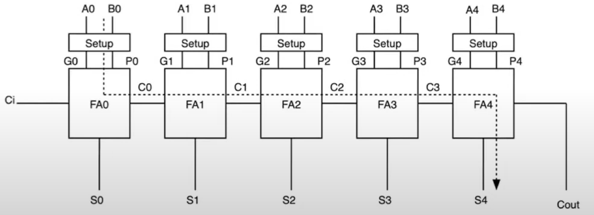

The propagation delay is:

$$t_{pd} = t_{gp} + (N - 1)t_{carry} + t_{sum}$$

, where $t_{gp}$ is time comsuming at *Setup* unit, which is parallel.

### Ripple-carry Bypass Adder

The ripple-carry adder (also called, *ripple-carry skip adder*) can be optimized to result in the *Ripple-carry Bypass adder*.

**Only $P_0P_1P_2$ = 1** (line 6), then the Multiplexer selects the bypass line.

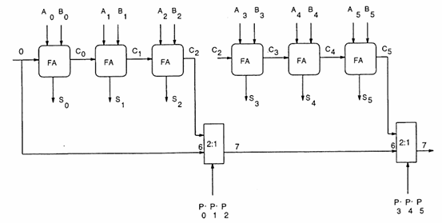

The propagation delay is

$$t_{add} = (M - 1)t_{67} + 2 (\frac{N}{M})t_{14} + t_{constant}$$

, where $M$ is the number of modules (sections)

$N$ is the total bits of ripple-carry bypass adder, here N = 6, 6-bit adder

, define $K = \frac{N}{M}$, is the bit of one ripple-carry adder.

The time complex becomes $$O(\frac{N}{M})$$

**In another expression**

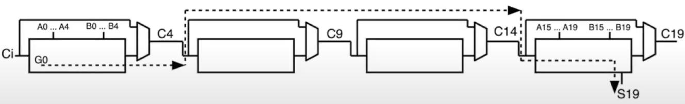

The progagation delay is

$$t_{pd} = t_{gp} + K t_{carry} + (\frac{N}{K} - 1) t_{mux} + ((K - 1) t_{carry} + t_{sum})$$

Find the optimal $K$ that gives the minimum value of $t_{pd}$

$$\frac{\partial t_{pd}}{\partial K} = 2 t_{carry} - \frac{N}{K^2} t_{mux} = 0$$

$$K = \sqrt{\frac{N t_{mux}}{2 t_{carry}}}$$

Of course, $K$ should be an integer.

When $K = \sqrt{\frac{N t_{mux}}{2 t_{carry}}}$, the time complex becomes $$O(\sqrt{2N})$$

, if $t_{carry} = t_{mux}$

### Ripple-carry Select Adder

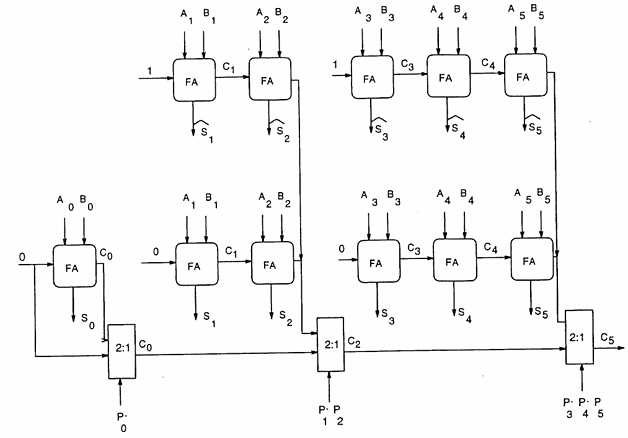

First, each section uses two ripple-carry adders that generate the sum bits for the each bypass section for **both possible values of the carry-in concurrently**. 

Second, the sections in the bypass adder are made of **unequal** and **monotonically increasing**

The sum numbers of adders in each section will be,

$$1 + 2 + 3 + ... + M = \frac{M(M+1)}{2} = N$$

This approximately equals to

$$M = \sqrt{2N}$$

The propogation delay will be

$$t_{add} = (M - 1) t_{67} + t_{constant} = (\sqrt{2N} - 1) t_{67} + t_{constant}$$

The time complex is $$O(\sqrt{2N})$$

**In another expression**

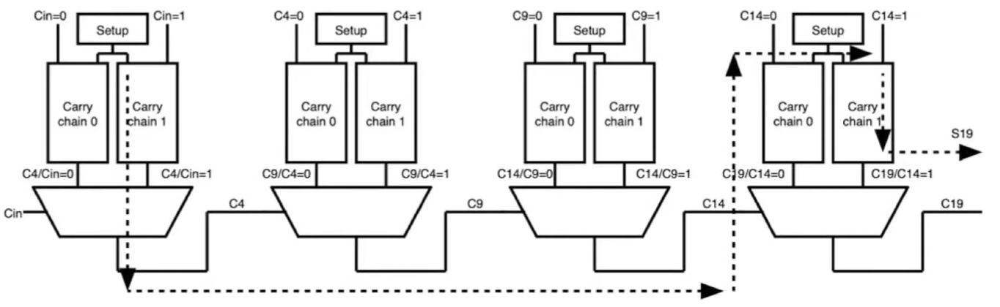

If **all the section have the same numbers of ripple-adders**, the propagation delay is

$$t_{pd} = t_{gp} + (\frac{N}{K} - 1) t_{mux} + (K - 1) t_{carry} + t_{sum}$$

If **all the section have the same numbers of ripple-adders**

|   Carry               |   Delay to calculate conditional carries  |   Delay to multiplex carries  |
|-----------------------|-------------------------------------------|-------------------------------|
|  $C_{4}$              |       $5T_{carry}$                        |          N/A                  |
|  $C_{9}/0, C_{9}/1$   |       $5T_{carry}$                        |  $5 T_{carry} + T_{mux}$      |
|  $C_{14}/0, C_{14}/1$ |       $5T_{carry}$                        |  $5 T_{carry} + 2T_{mux}$     |
|  $C_{19}$             |       $5T_{carry}+2T_{mux}+5T_{carry}$    |          N/A                  |

From $C_{9}/0, C_{9}/1$ to $C_{14}/0, C_{14}/1$, the difference between **Delay to multiplex carries** and **Delay to calculate conditional carries** becomes larger, which is not a fixed time.

To make the **Delay to multiplex carries** is only **one delay** after **Delay to calculate conditional carries** (assume $t_{carry} = t_{mux}$), make **the number of adders in each section increase monotonically**:

$$N = 1 + 2 + ... + M = M \frac{(1+M)}{2}$$

, which will increase **Delay to calculate conditional carries** by 1 delay.

This approximately gives:

$$M = \sqrt{2N} = \frac{N}{K}$$

Now, the propagation delay for the necessary path

$$t_{pd} = t_{gp} + Kt_{carry} + (\sqrt{2N} - 1)t_{mux} + (K - 1)t_{carry} + t_{sum}$$

The time complex is $$O(\sqrt{2N})$$

## Carry-Lookahead Adders

**Disadvantages of Ripple-Carry adders**

- the dependence of the sum and *the carry bits of any stage on the carry bit of preceding adder*.

### Generate, Delete and Propagation

|   A   |   B   |   $\text{C}_{\text{in}}$    |   $\text{C}_{\text{out}}$   |   S   |   G   |   D   |   P   |
|-------|-------|-----------------------------|-----------------------------|-------|-------|-------|-------|
|   0   |   0   |           0                 |           0                 |   0   |   0   |   1   |   0   |
|   0   |   0   |           1                 |           0                 |   1   |   0   |   1   |   0   |
|   0   |   1   |           0                 |           0                 |   1   |   0   |   0   |   1   |
|   0   |   1   |           1                 |           1                 |   0   |   0   |   0   |   1   |
|   1   |   0   |           0                 |           0                 |   1   |   0   |   0   |   1   |
|   1   |   0   |           1                 |           1                 |   0   |   0   |   0   |   1   |
|   1   |   1   |           0                 |           1                 |   0   |   1   |   0   |   0   |
|   1   |   1   |           1                 |           1                 |   1   |   1   |   0   |   0   |

Generate:

$$ G = AB$$

Delete:

$$ D = \bar{A} \bar{B}$$

Propagate:

$$ P = A ⊕ B$$

Based on the *generate* and *propagate*:

$$C_{out} = G + PC_{in}$$

$$S = P ⊕ C$$

When $A = B = 1$, *generate*, $G = 1$, $C_{out} = 1$

When $A = B = 0$, *delete*, $D = 1$, $C_{out} = 0$

When $A \neq B$, *progate*, $P = 1$, $C_{out}$ depends on $C_{in}$

**Machester-Carry Chain**

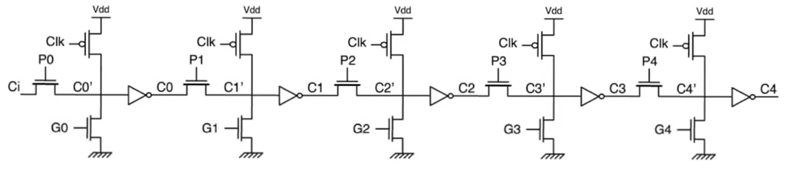

### Basic Idea

The dependence removed by

$$C_j = G_j + \sum_{i=0}^{j-1}(\Pi_{i+1}^{j}P_i)G_i + \Pi_{i=0}^{j}C_{in}$$

Examples:

$$C_0 = G_0 + P_0C_{in}$$

$$C_1 = G_1 + P_1C_0 = G_1 + P_1G_0 + P_1P_0C_{in}$$

$$C_2 = G_2 + P_2G_1 + P_2P_1G_0 + P_2P_1P_0C_{in}$$

The delay for them are

$$\text{pull up delay} + \text{pull down delay} = 4 + (1 + 2) = 7$$

$$\text{pull up delay} + \text{pull down delay} = 6 + (1 + 2 + 3) = 12$$

$$\text{pull up delay} + \text{pull down delay} = 12 + (1 + 2 + 3 + 4) = 22$$

The delay is quadratic delay, and the time complexity is

$$O(\frac{N^2}{2})$$

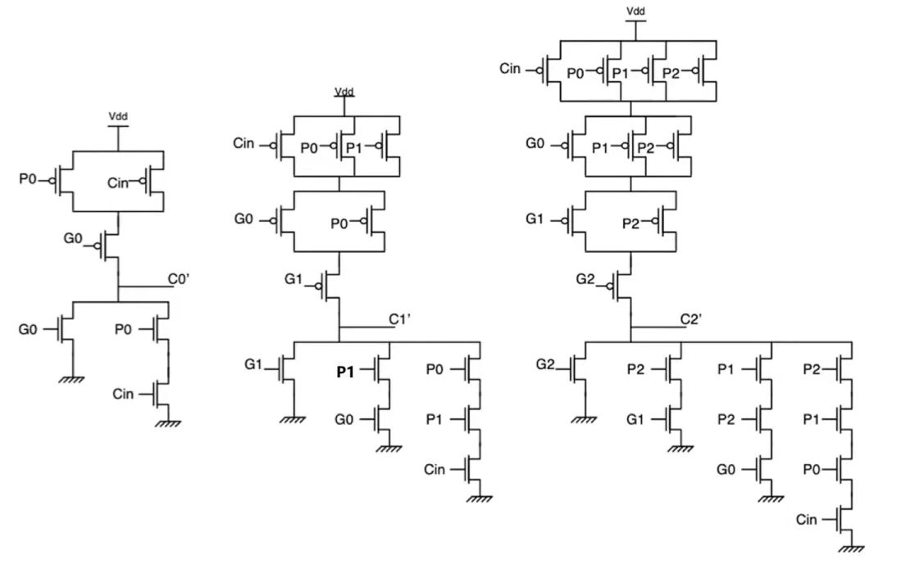

To reuse the circuit, try to use **Mancester Carry Chain** without invertor.

### Reformulate the lookahead expression

$\diamond$ operation:

$$(G_1, P_1) \diamond (G_2, P_2) = (G_1 + P_1G_2, P_1P_2)$$

Two operators that extract the first element and the second element of the tuple, respectively,

$$G = F(G, P)$$

$$P = S(G, P)$$

We can now rewrite the carry-lookahead expression as follows

$$C_{-1} = 0$$

$$C_0 = G_0 = F(G_0, P_0)$$

$$C_1 = G_1 + P_1G_0 = F((G_1, P_1) \diamond (G_0, P_0))$$

$$C_j = F((G_j, P_j) \diamond (G_{j-1}, P_{j-1}) \diamond ... \diamond (G_0, P_0))$$

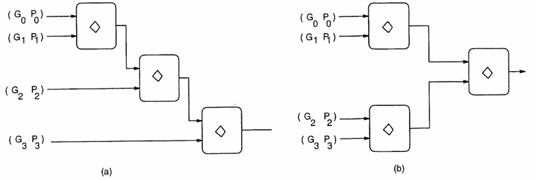

The $\diamond$ operator is not commutative but **associative**. The equvialent relativeship is shown above.

The seond implementation is clearly faster and the number of stages will be $$log_2N$$

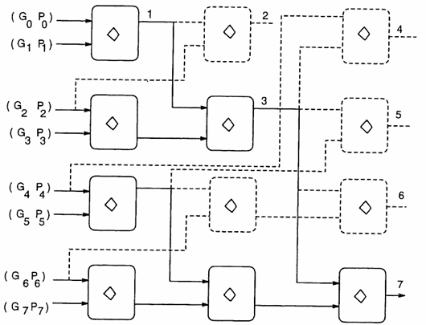

Above is a based on $\diamond$ operator 8-bit Lookahead Adder 

The carry-lookahead adder is about 100% larger than the ripple-carry adder, but the speed advantages for larger worldlengths ($N > 24$) are substantial.

### Group Generate and Propagation

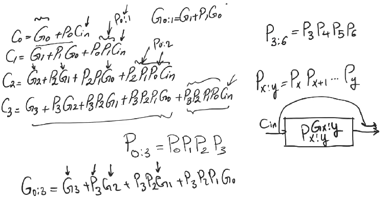

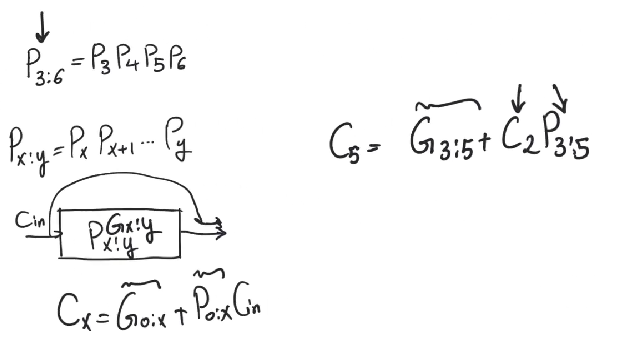

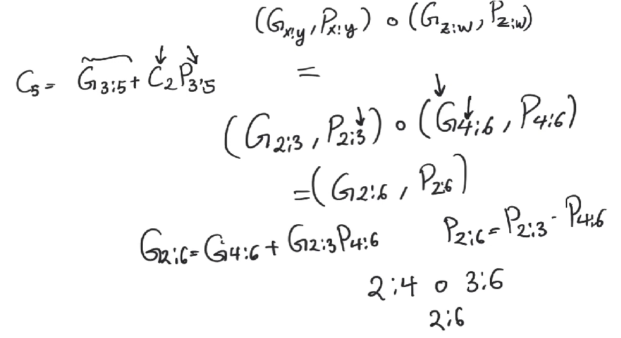

### Parallel prefix adders

**Koggle-Store Adder (K-S adder)**

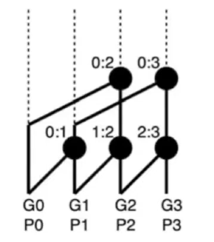

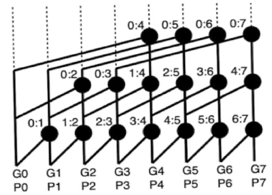

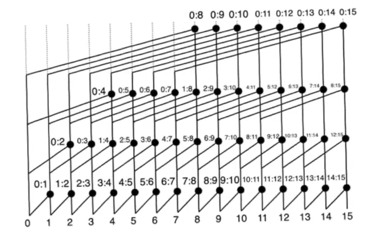

The time complexity is $$ceil(log_2N)$$, i.e $O(logN)$

The **routing** is a big issue of K-S adder

**Brent-Kung Adder (B-K adder)**

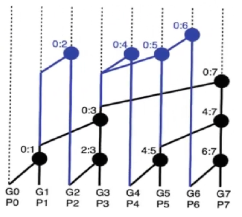

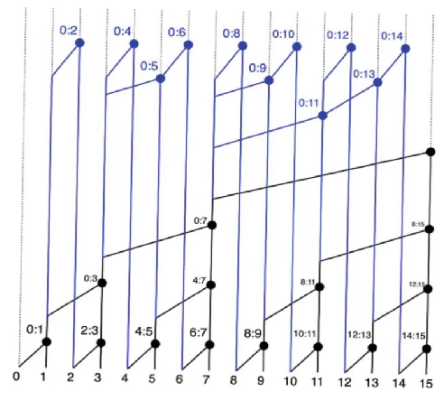

The **number of stages** is one disadvantage of B-K adder

Also, the number of fench for each node is no longer 2 (in the K-S adder). It might be four or more.

## Carry-Save Adders

If $x = x_{N-1}x_{N-2}...x_0$, $y = y_{N-1}y_{N-2}...y_0$ and $z = z_{N-1}z_{N-2}...z_0$

Then $u = (u_{N-1}..u_0)$ and $v = (v_Nv_{N-1}...v_0)$

The expression will be:

$$u_i = x_i ⊕ y_i ⊕ z_i$$

$$v_{i+1} = majority[x_i, y_i, z_i]$$

$$v_0 = 0$$

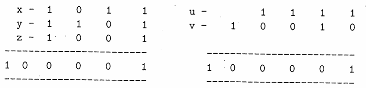

Note that *all elements* of $u$ and $v$ can be computed in parallel in time $O(1)$.

Then $u$ and $v$ can be added in $O(ln(N+1))$ time with a carry-lookahead additions.

E.g,. the sum of 9 numbers can be reduced to a sum of 6 numbers, which can be further reduced to 4 numbers, and then to the sum of 3 and then 2 numbers using the carry-lookahead adder.

# High Speed Multipliers

Both the $N$-bit inputs to the multiplier are assumed to be available, and it is desired that the result be available as soon as as possible.

The multiplication operation consists of two parts:

- **Generation of Partial Products**: The bits of the multiplier and the multiplicand are **AND-ed** together to produce the partial products (A, B, C, ...). These partial products can be generated in parallel in $O(1)$ time complexity.

- **Addition of Partial Products**: The N rows of partial products are then **added** together to generate the result. 

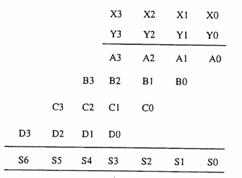

## Basic Array Multipliers

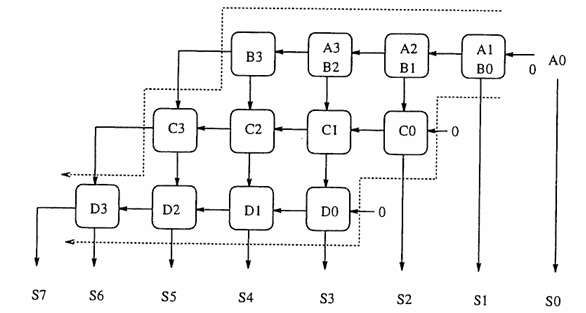

The partial products generated are used by 12 full adders (FA) to generate the result. 

The carry propagates (ripples) through the critical path as shown by the dotted lines. The total gate delay is that of 6 full adders (each with 4 gate delays, to add up A3, B2, C1 and D0, need a 4-bit adder, and thus each adder causes 4 gate delay), resulting in a total of 24 gate delays.

This is added to 1 gate delay (to get the partial products), and therefore the total delay is $4 \times 6 + 1 = 25$ gate delays.

The total number of gates is the sum of 16 gates to generate the partial products and 12 binary adders, each of which has 10 gates. The total number of gates is $4 \times 4 + 4 \times 3 \times 10 = 136$

### Half adder and Full adders combined

4-bit number x 4 bit number = 8-bit number 

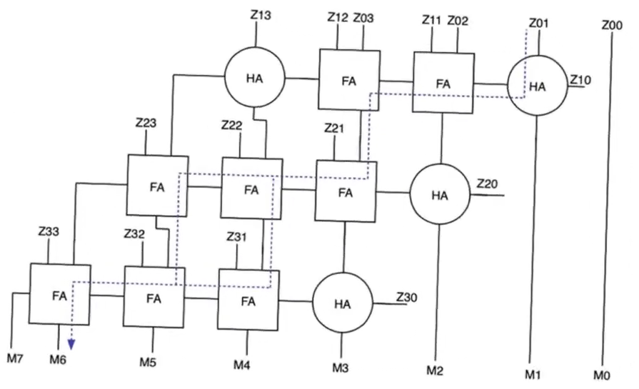

The time delay for critial path is (Assume, N x M multipliers)

$$t_{mult} = t_{carry}^{HA} + Mt_{sum}^{FA} + (N - 1)t_{carry}^{FA}$$

If assume $t_{carry}^{HA} = t_{sum}^{FA} = t_{carry}^{FA} = t_s$ and $M = N$, then

$$t_{mult} \approx 2Nt_s$$

So, at least, the multipliers at least 2 times slower than the same scale adder (actually, much slower)

## Carry-Save Multipliers

The speed at which the partial products are added together can be increased by **postponing** the *addition of the carry (by sending it)* to the **next** stage of full adders.

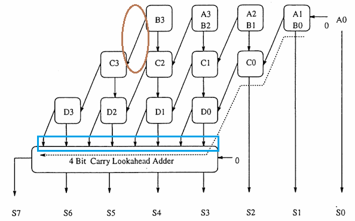

As a consequence, the critical path (as shown by the dotted line) is reduced to three plus the delay in the lookahead adder.

The carry-save addition (CSA) can be further optimized to:

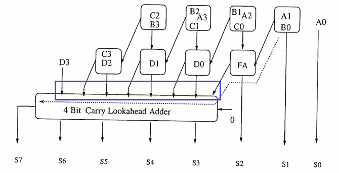

## Wallace Tree Multipliers

The **Wallace Tree Multipliers** operates on the rows of partial products **in parallel**, reducing $N$ rows to $floor(2N/3)$ row in $O(1)$ time.

This is recursively repeated until only two rows of numbers are left, which can be added using a carry-lookahead adder (CLA)

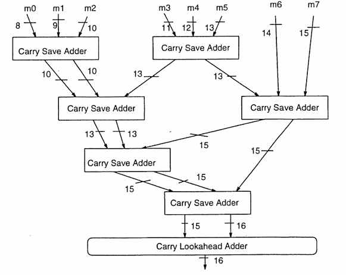

The propagation delay of Wallace tree is calculated as follows:

- The time to generate the partial products: $$t_{AND} = 1$$ gate delay.

- The time of Wallace Tree Reduction Delay:

The way to calculate the Wallace Tree Reduction **stages** is

$$r_{j+1} = 2 \times \textit{floor}(\frac{r_j}{3}) + r_j \textit{ mod } 3$$

, where $r_0 = N$. Keep calculate $r_{j+1}$ until $r_{j+1} = 2$.

e.g., $$r_0 = N = 8$$

$$r_1 = 2 \times floor(\frac{8}{3}) + 8 \textit{ mod } 3 = 6$$

$$r_2 = 2 \times floor(\frac{6}{3}) + 6 \textit{ mod } 3 = 4$$

$$r_3 = 2 \times floor(\frac{4}{3}) + 4 \textit{ mod } 3 = 3$$

$$r_4 = 2 \times floor(\frac{3}{3}) + 3 \textit{ mod } 3 = 2$$

Now, $r_4 = 2$, and stop. Stages = 4.

In the *Wallace Tree Reduction* stage use **carry-save adders**, the time delay for each 8-bit carry-save adders is:

$$ceil(log_2(N + 1)) = ceil(log_2(8 + 1)) = 4$$

So, the time of Wallace Tree Reduction is: $$t_{Wallace} = 4 \times 4 = 16$$ gate delays.

- The time of Look-Ahead Adder (CLA): $$t_{Final Adder} = 2 \times log_2(N) = 2 \times log_2(8) = 2 \times 3 = 6$$ gate delays.

The reason why there are **two stages** of carry-lookahead adder is based on this figure:

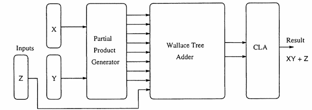

One carry-lookahead adder is at the last stage of Wallace Tree Adder, and another is at the outside.

Finally, the total time delay for this 8-bit unpipelined Multiply-Accumulate (MAC) is:

$$T_{total} = t_{AND} + t_{Wallace} + t_{Final Adder} = 1 + 16 + 6 = 23$$

### Wallace Tree Multipliers Stage Example

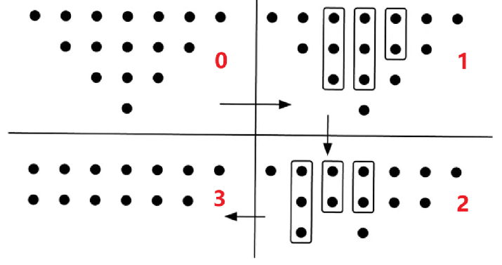

The stage for this 4-bit Wallace Tree Multiplier (N = 4) is 2.

## Three guidelines to design efficient arithmetic circuits

### Right Structure

The right structure has to be chosen for the functional unit before proceeding with elaborate optimization.

### Critial Path

The critial path of the circuit should be identified and its length minimized. The use of efficient CAD tools for this purpose is important and often indispensable.

### Circuit Size

Circuit Size is not always determined by the number of transistors. Interconnection area, wires, contacts and other factors can contribute significantly to the size of the circuit. These factors are likely to predominate circuit design in the regime of shrinking feature sizes and need be estimated carefully.

# Distributed Arithmetic for MAC

## Distributed Arithmetic (DA)

DA is an efficient technique for calculation of 

- **sum of products** 

- **vector dot product** 

- **inner product**

- **multiply and accumulates (MAC)**

Advantages of DA are best exploited in **data-path** circuit desigining. 

- data-path refer to the those digital electrical elements excluding **controlers** in CPU, GPU, TPU, FPGA, ASIC

- adder / multipler

- multiplexer / demultiplexer

- accumulator / shifter

- register

Area savings from using DA can be up to 80% and seldom less than 50% in digital signal processing hardware designs.

DA efficiently implements the MAC using basic building blocks (Look Up Table, LUT) in FPGAs.

### Definition

$$ y = \sum_{k=1}^{K} A_kx_k$$

- $A = [A_1, A_2, ..., A_k]$ is a **matrix** (think $A_k$ as a *M-bits* vector) of **constant** values

- $x = [x_1, x_2, ..., x_k]$ is a **matrix** (think $A_k$ as a *N-bits* vector) of input **variables**

- Each $A_k$ is of **M-bits**

- Each $x_k$ is of **N-bits**

- y should be large enough to accommodate the result

### Some hand-on examples

**2x2 inputs**

$$A_1 = 2 (0b0010), A_2 = 4 (0b0100)$$

$$C_1 = 2 (0b10), C_2 = 3 (0b11)$$

Write $A$ as:

$$A = \begin{pmatrix} A_1 \\ A_2 \end{pmatrix} = \begin{pmatrix} 2 \\ 4 \end{pmatrix}$$

Write $x$ as:

$$x^T = \begin{pmatrix} C_1 \\ C_2 \end{pmatrix}^T = \begin{pmatrix} 1 & 0 \\ 1 & 1 \end{pmatrix}$$

So the output y will be:

$$y = \sum_{k=1}^{K} A_kx_k = 2 \times (2 \times 1 + 4 \times 1) + 1 \times (2 \times 0 + 4 \times 1) = 16$$

**3x3 inputs**

$$A_1 = 2 (0b0010), A_2 = 4 (0b0100), A_3 = 3 (0b0011)$$

$$C_1 = 2 (0b10), C_2 = 3 (0b11), C_3 = 1 (0b01)$$

Write $A$ as:

$$A = \begin{pmatrix} A_1 \\ A_2 \\ A_3 \end{pmatrix} = \begin{pmatrix} 2 \\ 4 \\ 3\end{pmatrix}$$

Write $x$ as:

$$x^T = \begin{pmatrix} C_1 \\ C_2 \\ C_3 \end{pmatrix}^T = \begin{pmatrix} 1 & 0\\ 1 & 1 \\ 0 & 1 \end{pmatrix}$$

So the output y will be:

$$y = \sum_{k=1}^{K} A_kx_k = 2 \times (2 \times 1 + 4 \times 1 + 3 \times 0) + 1 \times (2 \times 0 + 4 \times 1 + 3 \times 1) = 19$$

### RTL design without transforming

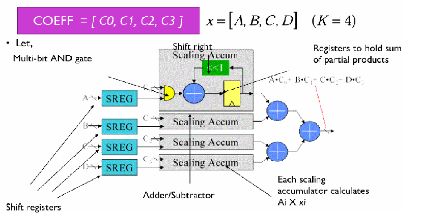

The "basic" DA techniques is **bit-serial** in nature (larger bit will increase the computing times)

But DA should be a **bit-level parallelism**(rearrangement) technique of the muliply and accumutlate operation.

- So, we need to rearrange the basic design to achieve bit-level parallelism.

DA hides the explicit multiplications by ROM look-ups, which is an efficient techniques to implement of FPGA.

## Distributed Arithmetic (DA) Transform

### Formula Transform

Let $x_k$ be a *N-bits* scaled two's complement number, i.e.

$$|x_k| < 1$$

This assumption is very important to map different ranges into [-1, 1).

And we denote vector:

$$x_k := \{b_{k0}, b_{k1}, b_{k2}, ......, b_{k(N-1)}\}$$

, where $b_{kn}$ means the kth variable $x_k$'s nth bit (is a binary bit, either 0 or 1).

Since $b_{k0}$ is the sign bit (0 represents positive, and 1 represents negative):

$$x_k = -b_{k0} + \sum_{n=1}^{N-1}b_{kn}2^{-n}$$

Here, give a example:

$$x_k := \{1, 0, 1\}$$

$$x_k = -1 + 0 \times 2^{-1} + 1 \times 2^{-2} = -0.75$$

, pay attention to the range of x_k ∈ $[-1, 1 - 2^{-(N-1)}]$ (roughly, [-1, 1])

The DA can be written as:

$$y = \sum_{k=1}^{K}A_kx_k$$

$$ = \sum_{k=1}^{K}A_k[-b_{k0} + \sum_{n=1}^{N-1}b_{kn}2^{-n}]$$

$$ = -\sum_{k=1}^{K}(A_kb_{k0}) + \sum_{k=1}^{K}A_k[\sum_{n=1}^{N-1}b_{kn}2^{-n}]$$

Rearrange the outer and inner sum, and get the final reformulation:

$$y = -\sum_{k=1}^{K}(A_kb_{k0}) + \sum_{n=1}^{N-1}[(\sum_{k=1}^{K}A_kb_{kn})2^{-n}]$$

### RTL design for Original vs Transformed

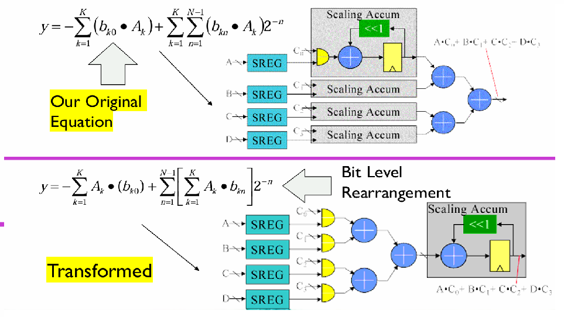

Now, we can use ROM to map the input serial bits into a table.

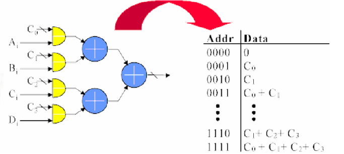

E.g. there are {A, B, C, D} ($K=4$) serial inputs, so there are 4 address lines to get the mapping data (2^4 = 16)

An another specific example is:

Let the number of taps $K=4$:

The fixed coefficients are $A_1 = 0.72, A_2 = -0.3, A_3 = 0.95$ and $A_4 = 0.11$

$$y = \sum_{n=1}^{N-1}[(\sum_{k=1}^{K}A_kb_{kn})2^{-n}] + \sum_{k=1}^{K}[A_k(-b_{k0})]$$

$\sum_{k=1}^{K}[A_k(-b_{k0})]$ and $\sum_{k=1}^{K}A_kb_{kn}$ just merge together and leads to $2^4 = 16$ results

- pay attention to $b_{kn}$ is a binary and only either be 0 or 1.

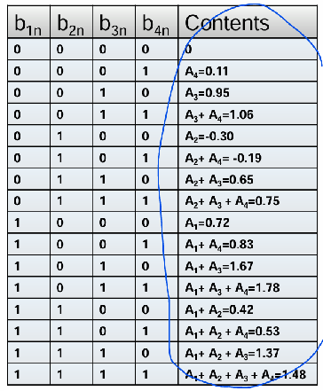

## Improvement on transformed DA

### Some issues of transformed DA

The size of ROM is very important for **high speed implementation** as well as **area efficiency**.

ROM size grows exponentially with each added input address line

- $2^k$ word, so once the size of input variables increase by 1, the ROM size doubles!!!

The number of address lines are equal to the number of elements in the vector i.e. K.

### Offset coding

We know that:

$$x_k = \frac{1}{2}[x_k - (-x_k)]$$

and the 2's complement will give:

$$x_k = -b_{k0} + \sum_{n=1}^{N-1}b_{kn}2^{-n}$$

$$-x_k = -\bar{b}_{k0} + \sum_{n=1}^{N-1}\bar{b}_{kn}2^{-n} + 2^{-(N-1)}$$

so, based on the trick

$$x_k = \frac{1}{2}[-(b_{k0} - \bar{b}_{k0}) + \sum_{n=1}^{N-1}(b_{kn} - \bar{b}_{kn})2^{-n} - 2^{-(N-1)}]$$

Define the **offset code** as:

$$c_{kn} = b_{kn} - \bar{b_{kn}} \text{ if } n \neq 0 \text{ else } -(b_{kn} - \bar{b_{kn}})$$

, pay attention $c_{kn}$ belongs only to {-1, 1}

Finally,

$$x_k = \frac{1}{2}[\sum_{n=0}^{N-1}c_{kn}2^{-n} - 2^{-(N-1)}]$$

Using the new $x_k$, we can get:

$$y = \sum_{k=1}^{K}A_kx_k$$

$$= \frac{1}{2} \sum_{k=1}^{K} A_k [\sum_{n=0}^{N-1}c_{kn}2^{-n} - 2^{-(N-1)}]$$

$$= \sum_{n=0}^{N-1}[\frac{1}{2}\sum_{k=1}^{K}(A_kc_{kn})]2^{-n} - \frac{1}{2}\sum_{k=1}^{K}A_k2^{-(N-1)}$$

Let $$Q(c_{1n}c_{2n}...c_{kn}) = \frac{1}{2}\sum_{k=1}^{K}A_kc_{kn}$$ and $$Q(0) = -\frac{1}{2}\sum_{k=1}^{K}A_k$$:

$$y = \sum_{n=0}^{N-1}Q(c_{1n}c_{2n}...c_{kn})2^{-n} + 2^{-(N-1)}Q(0)$$

, pay attention to $Q(0)$ is a constant and $2^{-(N-1)}Q(0)$ is a constant as well.

### The example of offset coding

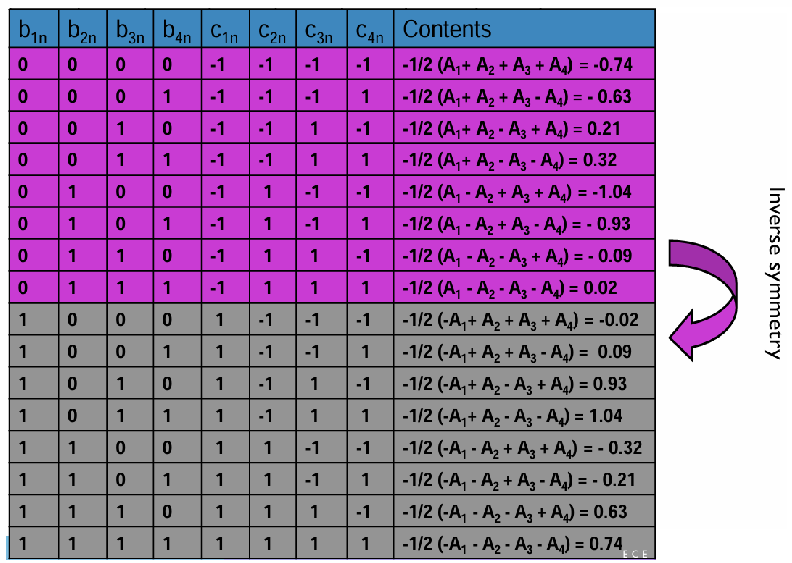

So for $K=4$, it only needs $2^4/2$ = 8 words.

**The RTL level of offset coding**  

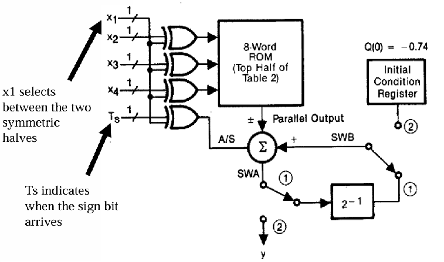

### Alternative Technique: decompostion the ROM

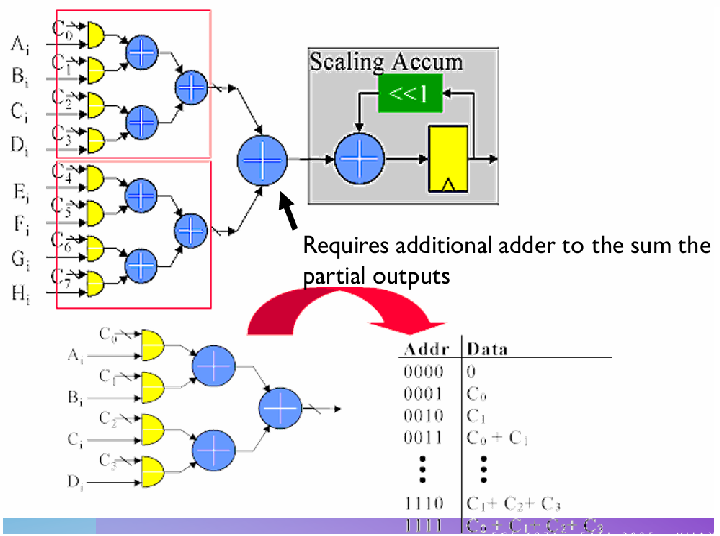

Instead of store the spereate value for offsets and add them up later, you can directly store those added data into a ROMs to avoid use additional adder.

### Speed up 

We consider One Bit At a Time (1 BAAT)

No. of Clock Cycles Required = N

If K = N, then we are taking 1 cycle per dot product. (a general case)

Opportunity for parallelism exits but at a cost of more hardware.

We could have 2 BAAT or up to N BAAT in the extreme case

If we have N BAAT, we can compelete result in only one cycle. (a ideal case)

**RTL level of 2 BAAT**

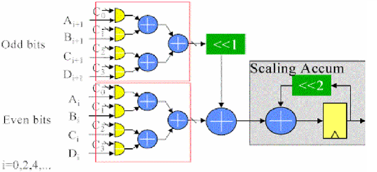

**RTL level of N BAAT**

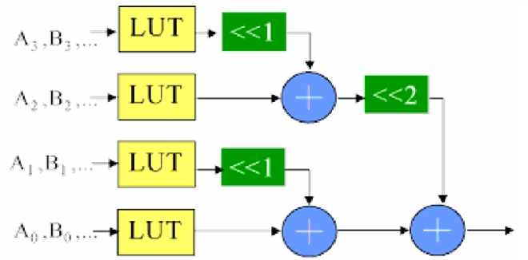

### Speed up Limitation: carry propagation

The speed in the critical path is limited by **the width of the carry propagation**.

Speed can be improved upon by using techniques to limit the carry propagation.

**Speed up with Residue Number System (RNS)**

- By using RNS, the computations can be broken down into smaller elements which can be executed in parallel

- Since we are operating on smaller arguments, the carry propagation is naturally limited

- By using RNS + DA, greater speed benefits can be attained, specially for higher precision calculations.

# CORDIC (Coordinate Rotation Digital Computer)

## Two rotation Example

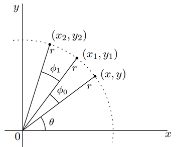

The initial position is $(x, y)$, the first rotation will give:

$$x_1 = r\cos(\theta + \phi_0) = r\cos\theta \cos\phi_0 - r\sin\theta \sin\phi_0 = x\cos\phi_0 - y\sin\phi_0 = \cos\phi_0(x - y\tan\phi_0)$$

$$y_1 = r\sin(\theta + \phi_0) = r\sin\theta \cos\phi_0 + r\cos\theta \sin\phi_0 = y\cos\phi_0 + x\sin\phi_0 = \cos\phi_0(y + x\tan\phi_0)$$

Let's the object angle be $\phi$, and the remaining error angle is:

$$z_1 = z_0 - \phi < 0 $$

So we need to continue to rotate in **counterclock** from current position $(x_1, y_1)$

$$x_2 = r\cos(\theta + \phi_0 + \phi_1) = r\cos(\theta + \phi_0)\cos\phi_1 - r\sin(\theta + \phi_0)\sin\phi_1 = x_1\cos\phi_1 - y_1\sin\phi_1 = \cos\phi_1(x_1 - y_1\tan\phi_1)$$

$$y_2 = r\sin(\theta + \phi_0 + \phi_1) = r\sin(\theta + \phi_0)\cos\phi_1 + r\cos(\theta + \phi_0)\sin\phi_1 = y_1\cos\phi_1 + x_1\sin\phi_1 = \cos\phi_1(y_1 + x_1\tan\phi_1)$$

the remaining error angle is:

$$z_2 = z_1 - \phi = 0$$

So, we don't need to further rotate the angle.

## Euler's Equation Iteration

If the above expressions of $x_i$ and $y_i$ is written in terms of initial point $x_0$ and $y_0$ then the expression will be:

$$x_i = \Pi_{j = 0}^{i-1}\cos\phi_j(...)$$

$$y_i = \Pi_{j = 0}^{i-1}\cos\phi_j(...)$$

Here, we don't decompose $(...)$ here, because later we will iterate $x_i$, $y_i$ and $z_i$ from $x_{i-1}$, $y_{i-1}$ and $z_{i-1}$

But so far, we can find that, $\Pi_{j=0}^{i-1}cos\phi_j$ is a constant and needn't be evaluated at each iteration. The value of this constant is:

$$\Pi_{j=0}^{i-1}cos\phi_j = \Pi_{j=0}^{i-1}\frac{cos\phi_j}{\sqrt{cos^2\phi_j + sin^2\phi_j}} = \frac{1}{\Pi_{j=0}^{i-1}\sqrt{1+tan^2\phi_j}}$$

### Macro rotation

Here we define **macro rotation** $\phi_j$ as

$$\phi_j = \tan^{-1}2^{-j} \text{ or } \tan \phi_j = 2^{-j}$$

Why we select such a serial of special values for $2^{-j}$? Because we can store them in binary.

Based on the specific macro rotation selection, constant $\Pi_{j=0}^{i-1}cos\phi_j$ will be:

$$\Pi_{j=0}^{i-1}cos\phi_j = \frac{1}{\Pi_{j=0}^{i-1}\sqrt{1+tan^2\phi_j}} = \frac{1}{\Pi_{j=0}^{i-1}\sqrt{1+2^{-2j}}} = \frac{1}{k_i}$$

, where 

$$K_i = \Pi_{j=0}^{i-1}\sqrt{1+2^{-2j}}$$

, which is called as **Compensation coefficient**

### Angle representation based on macro rotation

Angle representation is very important in this case as every iteration corresponds to an incremental rotation. The most used angle rotate for data with of $m$ is:

$$\begin{pmatrix} -\pi, & \frac{\pi}{2^1}, & \frac{\pi}{2^2}, & \frac{\pi}{2^3}, & ... & \frac{\pi}{2^m-1} \end{pmatrix}$$

The two MSB bits can represents the location of the co-ordinates in any quardant.

|   2 MSBs  | Angle                     | Quardant  |
|-----------|---------------------------|-----------|
|   00      | [$0$, $\frac{\pi}{2}$)    |  first    |
|   01      | [$\frac{\pi}{2}$, $\pi$)  |  second   |
|   10      | [$\pi$, $\frac{3\pi}{2}$) |  third    |
|   11      | [$\frac{3\pi}{2}$, $2\pi$)|  fourth   |

E.g. the angle of 45 degree ($\frac{\pi}{4}$) can be written as $16'b0010000000000000$ in 16 bit format, which is the first quardant.

### The sign of angle difference

The sign of angle difference ($z_i$), decides the direction of the next mirco rotation and defined as $\sigma$:

$$\sigma_i = 1 \text{ if } z_i \ge 0 \text{ else }-1$$

Another point is that these micro rotations do not exactly follow the circular path as the constant term $cos\phi_{i-1}$ is associated with each micro rotation.

For the simplicity of calculation, the constant term is not calculated in each iteration. **Computation is done without the constant term and after the final iteration, computed results are divided by the constant term**. 

## Iteration formula

Remember that $\tan \phi_i = 2^{-i}$, the iteration formula for $x_i$, $y_i$ and $z_i$ will be:

$$x_{i+1} = x_i - \sigma y_i 2^{-i}$$

$$y_{i+1} = y_i + \sigma x_i 2^{-i}$$

$$z_{i+1} = z_i - \sigma \tan^{-1} 2^{-i}$$

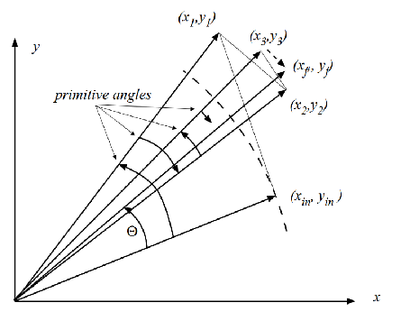

The above graphs show the successive rotations, where 1st macro rotation is positive, 2nd macro rotation is negative, 3rd macro rotation is positive, and so on so forth until the angle difference becomes 0.

There is another macro roataion represnetation (12-bit width and 2 MSBs represent quadrant):  

$$\begin{pmatrix} \text{MSB}_1 & \text{MSB}_0 & 0.7854 & 0.4636 & 0.2450 & 0.1244 ... & 0.0020  \end{pmatrix}$$

The corrsponding table between macro rotation ($2^{-i}$) and angle is:

|   i   |   $2^{-i}$ ($\tan \phi_i$)   |   $\tan^{-1}(2^{-i})$ ($\phi_i$) [radian]    |
|-------|------------------------------|----------------------------------------------|
|   0   |   1                          |   45° [0.7854]                               |
|   1   |   0.5                        |   26.57° [0.4636]                            |
|   2   |   0.25                       |   14.04° [0.2450]                            |
|   3   |   0.125                      |   7.13° [0.1244]                             |
|   4   |   0.0625                     |   3.58° [0.0624]                             |
|   5   |   0.003125                   |   1.79° [0.0312]                             |
|   6   |   0.015625                   |   0.90° [0.0160]                             |
|   7   |   0.0078125                  |   0.45° [0.0080]                             |
|   8   |   0.00390625                 |   0.22° [0.0040]                             |
|   9   |   0.001953125                |   0.11° [0.0020]                             |

E.g, consider a rotation to 28° using such a macro rotation representation：

$$28° \approx 45 - 26.57 + 14.04 - 7.13 + 3.58 - 1.79 + 0.90 - 0.45 + 0.22 + 0.11 = 27.91°$$

$$49.5° = 45 + 26.56 - 14.04 - 7.13 - 3.58 + 1.79 + 0.90 = 49.5°$$

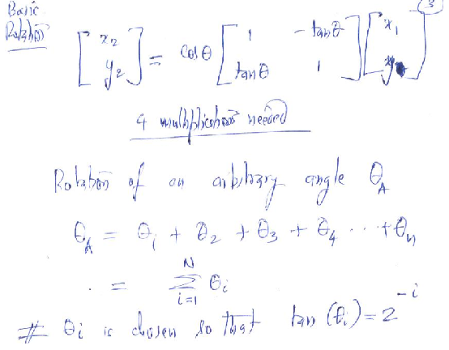

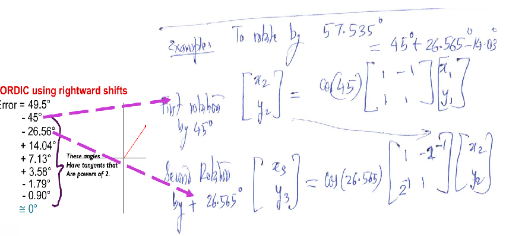

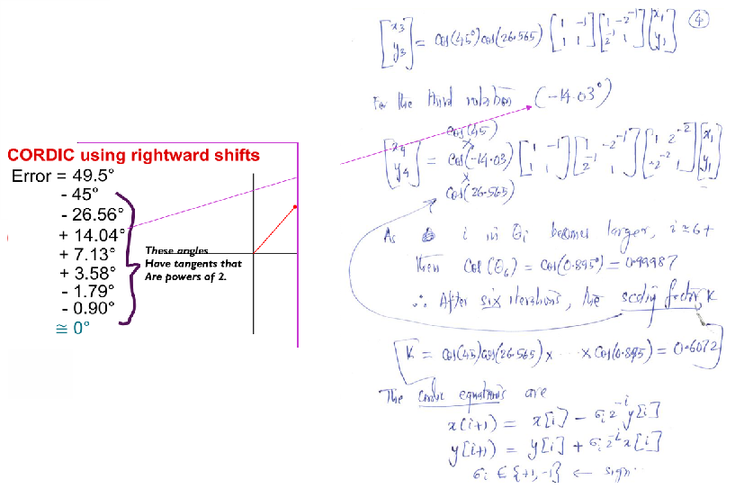
